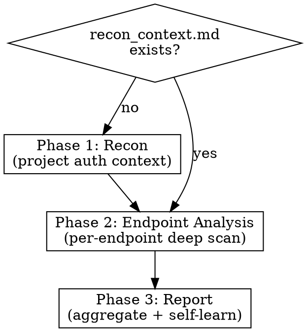

# AuthScan — Universal Authorization Vulnerability Audit

Analyze code for authorization vulnerabilities by tracing trust relationships between user-controlled parameters and authentication anchors (session IDs, auth tokens, trusted internal sources). Works across languages and frameworks through semantic understanding.

## Invocation

```
/authscan "/api/users/getInfo"                      # Analyze specific HTTP endpoint
/authscan "com.example.controller.UserController"    # Analyze by class/module index
/authscan --recon                                    # Project reconnaissance only
/authscan --all                                      # Full project scan
```

## Core Concept

**Authorization vulnerability = user-controlled parameter reaches a data operation without establishing trust relationship with an authentication anchor.**

Trust relationship can form at ANY point in the data flow — before, during, or after the data operation. The analysis traces the complete lifecycle of each parameter.

## Three-Phase Workflow



### Phase 1 — Project Reconnaissance

Read and follow `reference/recon.md`.

**When to run:** Always run first if `recon_context.md` does not exist in the results directory for this project. Skip if it already exists and user hasn't requested `--recon`.

**Output:** `results/{project_name}/recon_context.md` — project-level auth context reused by all endpoint analyses.

### Phase 2 — Per-Endpoint Deep Analysis

Read and follow `reference/endpoint-analysis.md`.

**Runs once per target endpoint.** Loads `recon_context.md` as background context.

Four analysis layers:
- **Layer 0**: Endpoint-level auth check (unauthorized access / vertical privilege escalation)
- **Layer 1**: Input parameter forward trust chain (horizontal privilege escalation)
- **Layer 2**: Output parameter backward trust chain (data leakage) — see `reference/output-analysis.md`
- **Layer 3**: Mass assignment check (write operations)

**Output:** `results/{project_name}/{endpoint_name}/analysis.json`

### Phase 3 — Aggregation & Report

Read and follow `reference/report.md`.

**Output:** `results/{project_name}/report.md` + `report.json`

## Execution Protocol

1. Parse user argument to determine mode:
   - `--recon` → Phase 1 only
   - `--all` → Phase 1 + Phase 2 for all discovered endpoints + Phase 3
   - Specific endpoint → Phase 1 (if needed) + Phase 2 for that endpoint + Phase 3
2. Set up results directory: `results/{project_name}/`
3. Execute phases in order, loading sub-documents as needed
4. Each phase produces structured output files that feed into the next phase

## Key References (load on demand)

**Methodology:**
- `reference/recon.md` — Phase 1 detailed methodology
- `reference/endpoint-analysis.md` — Phase 2 detailed methodology (Layer 0-3)
- `reference/output-analysis.md` — Phase 2 Layer 2 detailed methodology
- `reference/report.md` — Phase 3 detailed methodology

**Knowledge Base (prioritized pattern matching — model should check these FIRST before autonomous exploration):**
- `reference/trust-propagation-rules.md` — 8 core trust rules with examples (MUST read during Phase 2)
- `reference/auth-patterns-java.md` — Java auth patterns by priority (load during Phase 1 for Java projects)
- `reference/auth-patterns-python.md` — Python auth patterns by priority (load during Phase 1 for Python projects)
- `reference/auth-patterns-common.md` — Cross-language auth patterns (JWT, OAuth2, RBAC, etc.)
- `reference/datasink-patterns.md` — Data operation patterns that require authorization
- `reference/mass-assignment-patterns.md` — Mass assignment risk patterns

**Learned patterns (load alongside reference files):**
- `learned_patterns/discovered-auth-patterns.md` — Previously discovered patterns confirmed by user

## Pattern Matching Strategy

**Reference-first, autonomous-second:**
1. During Phase 1 (recon), load the language-specific auth patterns reference
2. Match known patterns by priority order using grep/glob
3. If all known patterns checked and gaps remain → autonomous exploration
4. During Phase 2, load trust-propagation-rules and datasink-patterns references
5. Apply known rules and patterns before making semantic judgments

## Self-Learning Protocol

If you discover an auth pattern NOT covered in the reference files during analysis:
1. Complete the current analysis using your semantic understanding
2. After analysis, in the report section, list all newly discovered patterns with full details:
   - Pattern name, framework/language, search keywords, mechanism description, code example
3. **Present the list to the user for confirmation** — do NOT automatically write to any reference file
4. The user decides whether to add each pattern to `learned_patterns/discovered-auth-patterns.md`
5. Only write to the learned patterns file after explicit user approval

**Rationale:** Reference quality matters. Incorrect patterns would degrade future analysis accuracy. User review ensures only validated patterns enter the knowledge base.

## Result JSON Location Tracking

**Every function reference in output JSON MUST include:**
```json
{
  "function": "ClassName.methodName",
  "file": "src/main/java/com/example/Controller.java",
  "line_start": 45,
  "line_end": 78
}
```
This enables re-verification — the LLM or human can jump directly to the code location to confirm findings.
