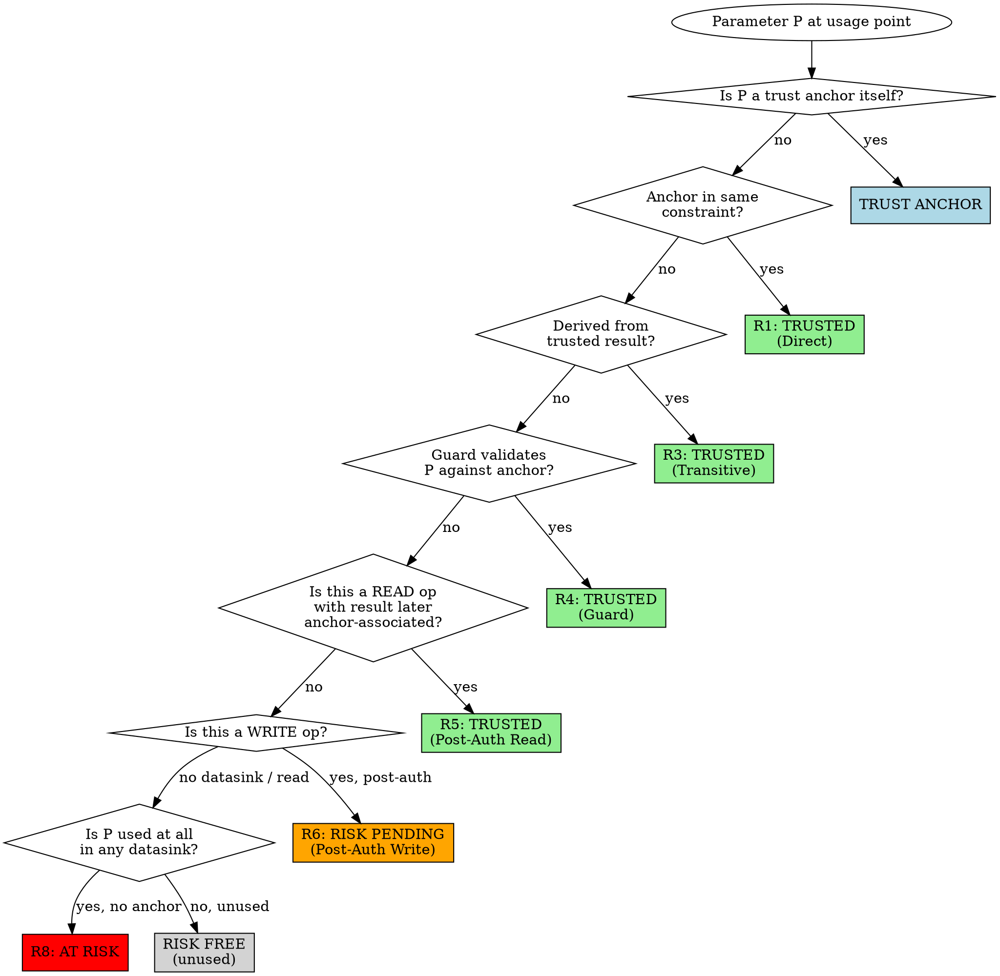

# Trust Propagation Rules

These 10 rules are the formal judgment framework for AuthScan's trust chain analysis. Apply them in order of specificity when evaluating each parameter usage point.

## The Rules

### R1 — Direct Association

**When:** Parameter and trust anchor appear in the same operation's constraint/condition.

**Result:** Parameter is **trusted**.

```java
// a1 is user-controlled, sessionUid is trust anchor
SELECT * FROM orders WHERE order_id = a1 AND user_id = sessionUid
//                         ^^^^^^^^^^^       ^^^^^^^^^^^^^^^^
//                         user param        anchor in same WHERE clause
// → a1 is TRUSTED (Direct Association with sessionUid)
```

```python
# Python equivalent
Order.objects.filter(id=order_id, user_id=request.user.id)
# → order_id is TRUSTED
```

### R2 — Derived Trust

**When:** Result comes from an operation that was constrained by a trust anchor (R1 applied to the query).

**Result:** All fields of the result are **trusted**.

```java
// Query from R1 example:
CResult c = db.query("SELECT c1,c2,c3 FROM t WHERE c1=? AND c3=?", a1, sessionUid);
// c is from an anchor-constrained query → c.c1, c.c2, c.c3 are ALL trusted
```

### R3 — Transitive Trust

**When:** Operation uses already-trusted data (from R1/R2/R3) as its constraint.

**Result:** Output is **trusted**.

```java
// c.c3 is trusted (from R2 above)
EResult e = db.query("SELECT e1,e2 FROM t2 WHERE e3=?", c.getC3());
// e3 comes from trusted c.c3 → R3 applies → e.e1, e.e2 are trusted
```

**Trust chain:** `sessionUid → c (R1+R2) → e (R3)`

### R4 — Conditional Guard

**When:** A condition compares the parameter (or its derivative) with a trust anchor, and the code throws/returns/aborts on mismatch. The parameter is trusted ONLY in the branch where the guard passes.

**Result:** **Trusted** in the passing branch.

```java
// Guard pattern: exception on mismatch
if (!order.getUserId().equals(sessionUid)) {
    throw new AccessDeniedException("Not your order");
}
// After this point: order and its fields are trusted (guard validated ownership)
```

```python
# Python guard
if obj.owner_id != request.user.id:
    raise PermissionDenied()
# After this: obj is trusted
```

**Distinguish from business logic conditions:**
```java
if (order.getStatus().equals("ACTIVE")) { ... }  // NOT auth → no trust change
```

**Permission service queries also qualify:**
```java
if (!permissionService.hasAccess(sessionUid, resourceId)) {
    throw new ForbiddenException();
}
// Both sessionUid and resourceId are now trusted in this context
// The permission table acts as the trust bridge
```

### R5 — Post-Auth Read (Retroactive Trust)

**When:** A READ operation uses untrusted parameters, but the result is LATER associated with a trust anchor (through a subsequent query, filter, or guard).

**Result:** The original parameter's read usage is **trusted** retroactively.

```java
// Step 1: Untrusted read
DResult d = db.query("SELECT d1,d2 FROM t WHERE d3=?", a3);  // a3 has no anchor

// Step 2: Result later associated with anchor
FilteredResult f = db.query("SELECT * FROM t2 WHERE key=? AND uid=?", d.d1, sessionUid);
return f;  // Only f is returned, not raw d

// Analysis: d.d1 → associated with sessionUid in step 2
// → R5: trust propagates back → d is effectively auth-covered → a3's read is trusted
```

**Key requirement:** The trust association must happen BEFORE the data reaches the user (return/response). If raw `d` is returned without filtering, R5 does NOT apply.

### R6 — Post-Auth Write (Risk Pending)

**When:** A WRITE operation (INSERT/UPDATE/DELETE, file write, network send) executes using untrusted parameters, and auth association happens only AFTERWARD.

**Result:** **Risk Pending** — the write is already executed and cannot be undone.

```java
// WRITE with untrusted param — IRREVERSIBLE
db.execute("DELETE FROM orders WHERE id=?", orderId);  // orderId has no anchor

// Auth check comes too late
Order order = db.query("SELECT * FROM orders WHERE id=? AND uid=?", orderId, sessionUid);
if (order == null) { throw new NotFoundException(); }  // DELETE already happened!

// → R6: Risk Pending — mark as HIGH severity
```

**R5 vs R6 distinction:**
- R5 (read): data can still be filtered before reaching user → retroactive trust valid
- R6 (write): operation has side effects that cannot be rolled back → risk remains

### R7 — Transform Neutral

**When:** A parameter undergoes transformation (toString, split, parseInt, format, trim, toUpperCase, substring, etc.).

**Result:** Trust status **unchanged**. Transformation does not create or destroy trust.

```java
String orderIdStr = String.valueOf(orderId);  // untrusted → still untrusted
Long parsed = Long.parseLong(input);          // untrusted → still untrusted
String[] parts = input.split(",");            // untrusted → each part still untrusted
```

### R8 — No Association

**When:** A parameter (or its derivatives) reaches a datasink without ANY trust anchor association throughout its entire data flow lifecycle. No R1-R6 applies.

**Result:** **At Risk** — this is a potential authorization vulnerability.

```java
// a3 is user-controlled, reaches datasink with no anchor anywhere
DResult d = db.query("SELECT d1,d2 FROM t WHERE d3=?", a3);
return d;  // d1, d2 returned to user based solely on user-controlled a3
// → R8: AT RISK — classic BOLA vulnerability
```

### R9 — Stored Identity Re-validation

**When:** Data retrieved from database/cache contains an **identity field** (operatorUserId, createdBy, ownerId, etc.) that represents WHO performed a previous action. This identity may differ from the current requesting user.

**Result:** The stored identity field is **NOT automatically trusted** even if the query that retrieved it has some auth binding. It MUST be **explicitly compared** with the current user's trust anchor. If no such comparison exists → **Identity Impersonation Risk (CRITICAL)**.

**Why this is separate from R1-R8:** R1-R8 determine whether a query result is "authorized data for this user." R9 goes further: even if you correctly retrieved data, a stored identity field within that data represents a DIFFERENT principal — the person who acted in a previous phase. The current user must prove they ARE that person.

```java
// Phase 1 stored: validateMO = {orderNo, enterpriseId, operatorUserId: "user_A"}
// Phase 2 reads it:
ValidateMO mo = repo.findByOrderNo(orderNo);  // even if query is auth-scoped

// R9 REQUIRES this check:
if (!currentUserId.equals(mo.getOperatorUserId())) {
    throw new AccessDeniedException("Not the original operator");
}
// Without this check → identity impersonation: attacker confirms as user_A

// Also: use stored values, not user input, for business operations:
order.setEnterpriseId(mo.getEnterpriseId());  // ✅ stored value
// NOT: order.setEnterpriseId(request.getEnterpriseId());  // ❌ user input
```

**R9 has TWO mandatory checks (both must pass):**

1. **Identity comparison:** Does the code verify `currentUserId == storedIdentityField`? If not → **CRITICAL: Identity Impersonation**
2. **Stored value usage:** For business operations, does the code use the stored field values (e.g., `mo.getEnterpriseId()`) or the user's input (e.g., `request.getEnterpriseId()`)? If user input is used when a stored value exists for the same field → **HIGH: Parameter Substitution Risk** (attacker can alter field values that should be fixed from Phase 1)

**Redundant parameter heuristic:** If a user-controlled input parameter has the SAME semantic meaning as a field in stored data (e.g., both represent `enterpriseId`), this is a design smell. The endpoint should use the stored value. Flag this for review even if trust chain analysis doesn't show a direct vulnerability.

**Detection pattern — multi-stage operations:**
- Phase 1: creates record, stores current user identity (operatorUserId) and business data
- Phase 2: reads record, uses stored identity and data for business operation
- **Check 1:** does Phase 2 verify `currentUserId == storedOperatorUserId`?
- **Check 2:** does Phase 2 use stored values (not user input) for business fields?
- Common in: order confirm, payment verify, approval complete, identity verification

### R10 — Trust Anchor Credibility

**When:** The trust anchor itself (session userId, JWT claims, etc.) may be derived from user-controllable sources under certain conditions.

**Result:** If the trust anchor can be user-controlled, it is **NOT a valid anchor** — all trust conclusions based on it are **invalidated**. Mark as **CRITICAL: Trust Anchor Compromised**.

**This undermines ALL other rules.** If R10 applies, even R1-R4 conclusions become meaningless — the "anchor" in those rules isn't actually trustworthy.

```java
// DANGEROUS: trust anchor has fallback to user input
@AuthAnnotation(noLoginExchangeUid = true)
public Result operation(Request request) {
    String currentUserId = null;

    // Source 1: RPC framework → trusted
    if (RpcHolder.getUserUid() != null) {
        currentUserId = RpcHolder.getUserUid();
    }
    // Source 2: Token verification → trusted IF token is valid
    else if (request.getToken() != null) {
        currentUserId = tokenService.verify(request.getToken());
    }
    // Source 3: FALLBACK TO USER INPUT → NOT TRUSTED!
    if (currentUserId == null) {
        currentUserId = request.getUserUid();  // ❌ attacker controls "trust anchor"
    }

    // Now ALL subsequent auth checks using currentUserId are MEANINGLESS:
    if (currentUserId.equals(order.getOwnerUserId())) {
        // Attacker set userId = ownerUserId → check passes!
    }
}
```

**Detection checklist:**
1. Does the endpoint have annotations allowing unauthenticated access? (`noLoginExchangeUid = true`, `permitAll`, etc.)
2. Does the trust anchor getter have fallback logic to user input? (e.g., `defaultIfEmpty(tokenUid, request.getUserUid())`)
3. Do gray toggles / feature flags control whether strict auth is enforced?
4. Is there a conditional path where the anchor comes from the request instead of the session/token?

**Gray toggle / feature flag risk pattern:**
```java
if (grayToggleManager.isHit("FORCE_CHECK_TOKEN")) {
    uid = tokenService.verifyStrict(token);  // strict → trusted
} else {
    uid = request.getUserUid();  // toggle off → user-controlled!
}
```

## Decision Flowchart



## Common Patterns to Recognize

### Pattern: Ownership Check Before Data Access
```java
Order order = orderRepo.findById(orderId);           // untrusted read
if (!order.getUserId().equals(currentUserId)) {       // R4 guard
    throw new AccessDeniedException();
}
return order;  // trusted after guard passes
```

### Pattern: Scoped Query (Most Common Auth Pattern)
```java
// User can only see their own orders — anchor in WHERE clause
List<Order> orders = orderRepo.findByUserIdAndStatus(currentUserId, status);
// → R1 for currentUserId, status is also trusted by association
```

### Pattern: Permission Table Lookup
```java
if (!aclService.canAccess(currentUserId, resourceId, "READ")) {
    throw new ForbiddenException();
}
Resource res = resourceRepo.findById(resourceId);
// → R4: resourceId trusted via permission check (guard passes)
```

### Pattern: Batch Operation with Partial Auth
```java
for (Long id : requestIds) {              // requestIds is user-controlled list
    Item item = itemRepo.findById(id);     // untrusted read per item
    if (item.getOwnerId().equals(uid)) {   // per-item guard
        results.add(item);                 // only guarded items added
    }
}
return results;  // R4 applied per-item → results are trusted
```

### Pattern: Late-Binding Auth (Post-Query Filter)
```java
List<Record> all = recordRepo.findByCategory(categoryId);  // untrusted bulk read
List<Record> mine = all.stream()
    .filter(r -> r.getUserId().equals(currentUserId))       // post-read filter
    .collect(Collectors.toList());
return mine;  // R5: read results filtered by anchor → trusted
// WARNING: Performance concern (fetching all then filtering) but auth is valid
```
